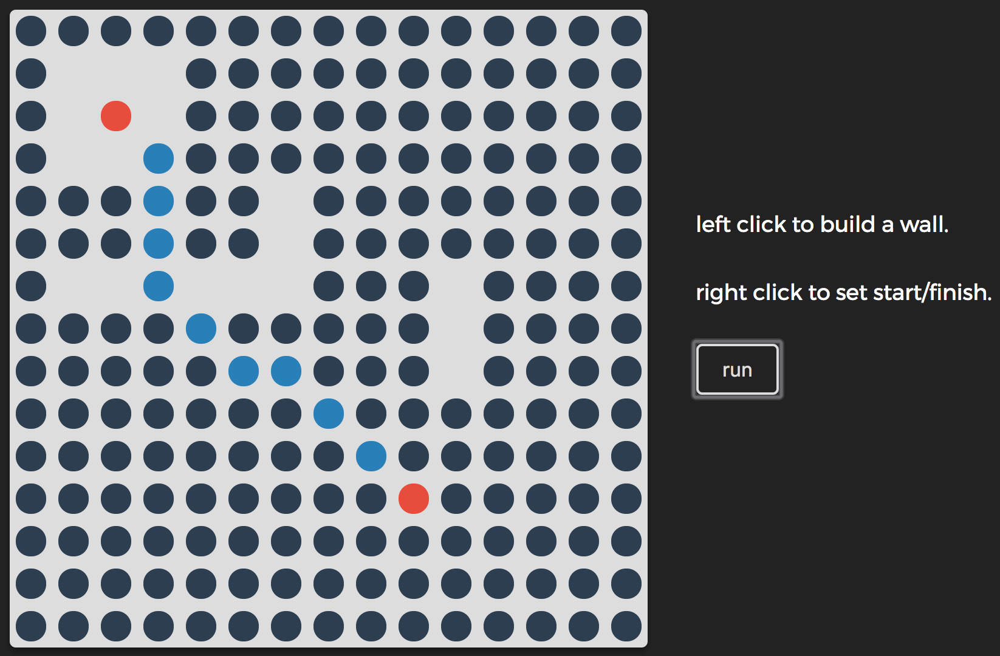

# Pathfinding

## (Old project from the dark ages)

One of my first projects when learning to code. It uses list-based [Djikstra's algorithm](https://en.wikipedia.org/wiki/Dijkstra%27s_algorithm) to prioritize diagonal movement (walk through the grass) over top/down/left/right movement (take the paved sidewalk), so the runtime is just *Θ(V2)*. 

I wrote this in object-oriented style just to get a feel for it, since I had never really used it before. 

All the vertices are just connected to their neighbors, and you can click a vertex to remove it from or add it back to the available path options.

